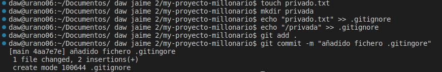
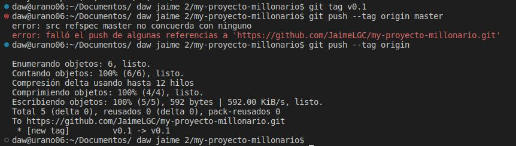

# Trabajo diario a través de git

- ## Creación del repositorio
    - El primer paso es crear unn repositorio llamado **"_my_-proyecto-millonario"** y añadirle un documento **README.md** marcando el proceso con cun commit inicial.

- ## Ignorar archivos
    - Creamos una carpeta y un archivo denomiandos privados que van a servir para ser ignorados. Una vez creados los añadimos al archivo **.gitignore** el cual hará que GIT ignore todos los elementos añadidos a este. Tras esto añadimos los cambios y hacemos el commit.

### Pregunta:
El fichero y el directorio privado debe de subir al repositorio si se encuentra añadido al fichero **.gitingnore.**
### Respuesta:
No, ya que el propósito del fichero .gitignore es el de omitir los archivos que se encuentren en su interior a la hora de hacer el commit.

- ## Añadir fichero 1.txt

 

### Pregunta:
Si ejecutado las acciones add y commit, que realiza cada una sobre el/los ficheros
### Respuesta:
La acción _add_ coge los cambios realizados en los ficheros y los pone en cola para realizar un nuevo _commit_
El _commit_ crea una nueva revisión o punto de control con esos cambios y les asigna un identificador

- ## Crear y subir el tag v0.1 

    - Subir los cambios al repositorio remoto.

### Pregunta:
¿Qué es un tag sobre un repositorio git, en nuestro caso Github?
### Respuesta:
Es una fomra de dejar una marca sobre un commit específico y todos los cambios anteriores a este para futuras comparaciones.

- ## Crear una rama v0.2 
 
    - Posiciona tu carpeta de trabajo en esta rama.

- ## Añadir fichero 2.txt y hacer un Merge directo
    - Añadir un fichero 2.txt en la rama v0.2.
    - Subir los cambios al reposiorio remoto.
    - Posicionarse en la rama master/main según sea tu rama principal.
    - Hacer un merge de la rama v0.2 en la rama master/main.

### Pregunta:
Cuando estamos trabajando con ramas, ¿cuál es su fin en organizaciones pequeñas/medianas/grandes?
### Respuesta:
Como dice el nombre es una ramificación del código maestro la cual se suele usar para trabajasr en nuevas adiciones de forma aislada, en el sentido de que no serán incluidas en el código maestro hasta que nosotros lo integremos.

### Pregunta:
¿Se tendrían que producir conflictos en esta acción?
### Respuesta:
No, es un merge básico.

- ## Merge con conflicto
    - En la rama master/main poner Hola en el fichero 1.txt y hacer commit.
    - Posicionarse en la rama v0.2 y poner Adios en el fichero "1.txt" y hacer commit.
    - Posicionarse de nuevo en la rama master/main y hacer un merge con la rama v0.2

- ## Listado de ramas
    - Listar las ramas con merge y las ramas sin merge.

- ## Arreglar conflicto
    - Arreglar el conflicto anterior y hacer un commit.

- ## Borrar rama 
    - Crear un tag v0.2
    - Borrar la rama v0.2

