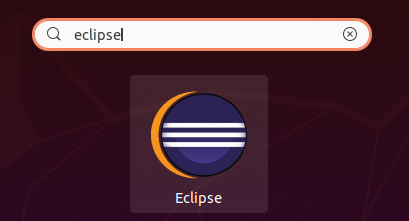
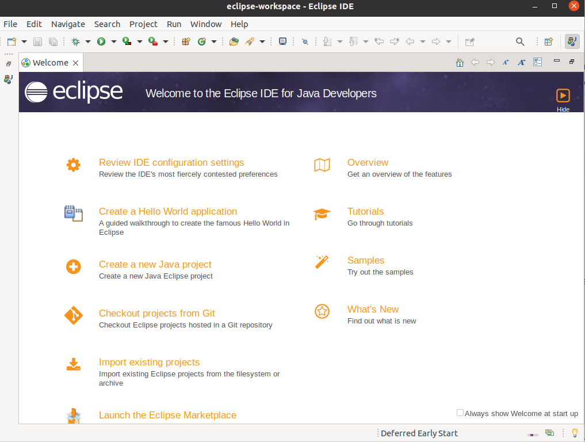

# Instalación del IDE Eclipse

## Índice
1. [Introducción](#introducción)
2. [Instalación](#instalación)
3. [Ejecución](#ejecución)

## Introducción
Eclipse es un **IDE gratuito** para la plataforma Java conocido por permitir a los usuarios desarrollar y probar código escrito en otros lenguajes.

En este documento repasaremos los pasos necesarios para su instalación en un **sistema operativo ubuntu.**

## Instalación
Antes de comenzar con la instalación, es importante tener **Java** instalado en nuestro sistema operativo. Para comprobar que tenemos Java instalado, se utiliza el siguiente comando:

Una vez comprobado, lo único que se necesita es ejecutar el comando que se muestra en la imagen, el cual enviara el paquete Snap con Eclipse directamente a nuestro sistema:

## Ejecución
Una vez instalado, podemos usar el buscador del sistema para encontrar y ejecutar Eclipse tal y como se muestra en la imagen.

