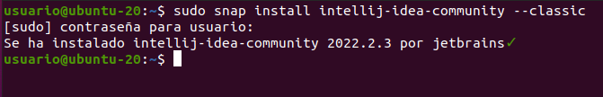

# Instalación del IDE IntelliJ IDEA

## Índice
1. [Introducción](#introducción)
2. [Instalación](#instalación)
3. [Ejecución](#ejecución)

## Introducción
EL ide IntelliJ IDEA permite a los usuarios encontrar fácilmente cualquier tipo de bug, código muerto o problema de rendimiento, además de mejorar la estructura del código.

En este documento repasaremos los pasos necesarios para su instalación en un sistema operativo ubuntu.

## Instalación
Antes de comenzar con la instalación, es importante tener Java instalado en nuestro sistema operativo. Para comprobar que tenemos Java instalado, se utiliza el siguiente comando:

Una vez comprobado, el único paso a seguir es ejecutar el comando que se muestra en la imagen, el cual enviara el paquete Snap con IntelliJ IDEA directamente a nuestro sistema:

## Ejecución
Una vez instalado, encontrar y ejecutar el programa a través del buscador de nuestro sistema tal y como se muestra en la imagen.

