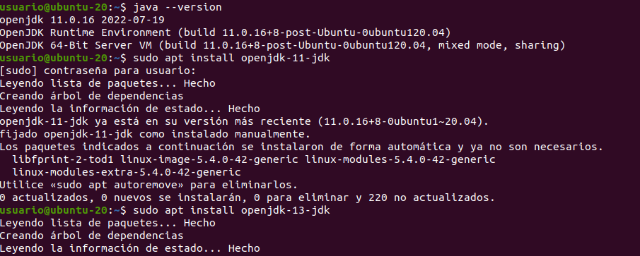
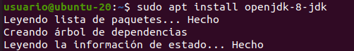
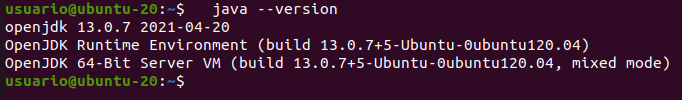

# Instalación de JDK

## Introducción
Java es un lenguaje de programación casi esencial para el funcionamiento de diversas herramientas.

En este documento de repasarán los pasos necesarios para su instalación en un sistema operativo ubuntu.

### Instalación general
El primer paso es actualizar el índice del paquete, instalar Java y, una vez completada la instalación, comprobar la versión instalada como se muestra en la siguiente imagen:

### Instalación de una versión específica
En el caso de querer instalar una versión específica hemos de utilizar el comando que aparece en la imagen, en estew caso específico para la versión 8.

Se puede comprobar la versión instalada con el siguiente comando

