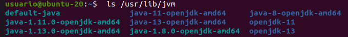
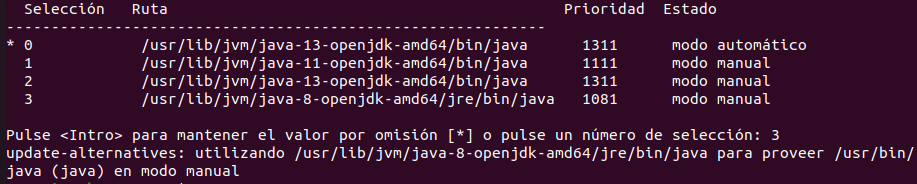

# Instalación de JDK

## Índice
1. [Introducción](#introducción)
2. [Instalación general](#instalación-general)
3. [Instalación de una versión específica](#instalación-de-una-versión-específica)
4. [Comprobación y listado de versiones](#comprobación-y-listado-de-versiones)

## Introducción
Java es un lenguaje de programación casi esencial para el funcionamiento de diversas herramientas.

En este documento se repasarán los pasos necesarios para su instalación en un sistema operativo ubuntu.

## Instalación general
El primer paso es actualizar el índice del paquete, instalar Java y, una vez completada la instalación, comprobar la versión instalada como se muestra en la siguiente imagen:

## Instalación de una versión específica
En el caso de querer instalar una versión específica hemos de utilizar el comando que aparece en la imagen, en este caso específico para la versión 8.

## Comprobación y listado de versiones
Se puede comprobar la versión instalada con el comando mostrado

Con este se puede, además, mostrar el listado con las versiones instaladas

Por último, así podemos actualizar de las variables de entorno

