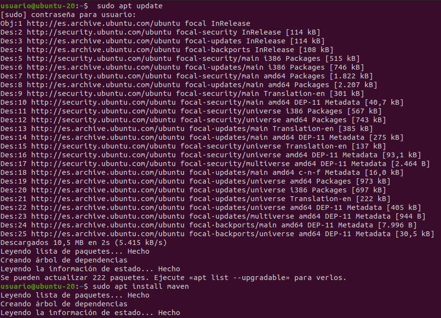
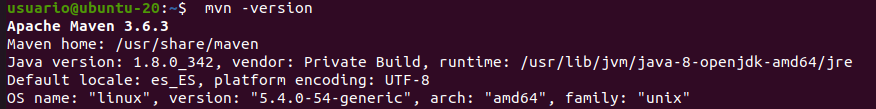
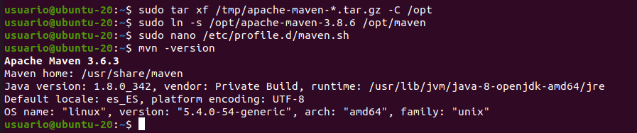

# Instalación de Maven

## Índice
1. [Introducción](#introducción)
2. [Instalación general](#instalación-general)
3. [Instalación de una versión específica](#instalación-de-una-versión-específica)
4. [Comprobación de la versión instalada](#comprobación-de-la-versión-instalada)

## Introducción
Apache Maven es una herramienta de código abierto usada para la compresión y publicación de muchos proyectos a la vez para una mejor gestión.

En este documento se repasarán los pasos necesarios para su instalación en un sistema operativo ubuntu.

## Instalación general
El primer paso para una instalación correcta es actualizar el índice del paquete e instalar Maven tal y como se muestra en la imagen:

Podremos comprobar la instalación con el siguiente comando, si todo ha salido correctamente el mensaje debería ser como el mostrado en la imágen:

## Instalación de una versión específica

Puede visitar la página de descarga de Maven y comprobar la versión más nueva. En nuestro caso descargaremos la versión Apache Maven 3.8.6. con el comando mostrado en la imagen:

Una vez que completada la descarga, los siguientes pasos son: extraer el archivo en el directorio, crear enlace que apunte al directorio de instalación y establecer variables de entorno:

En la nueva ventana, pega el siguiente código:

El último paso será hacer que el script sea ejecutable con chmod y cargar las variables de entorno usando el siguiente comando de source:

## Comprobación de la versión instalada

Con el siguiente comando se puede comprobar la versión que tenemos instalada, en nuestro caso Apache Maven 3.8.6.

